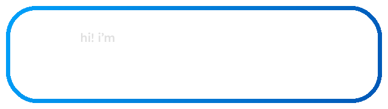

## Hi! I'm Alex 👋

I'm a Computer Science undergraduate at the [Rochester Institute of Technology](https://www.rit.edu/) with a passion for full-stack development and generative AI. I love building exciting projects and solving interesting technical challenges.

---

### What I'm Up To

- 📚 **Studying** Computer Science at RIT (Expected Graduation: May 2028)
- 💻 **Software Engineering Intern** at Real Wave Capital — building UIs for autonomous AI agents
- 🚀 **Founder** of Bay Area Stem Academy ([BASA](https://bayareastemacademy.org)), a non-profit providing free STEM education to students — we've reached over 700 learners!
- 👨‍💻 **Tinkering** with personal projects in my free time

---

### A Couple of My Projects

- [**Chatio Agentic Behavior Benchmark**](https://chatio.dev): An evaluation suite for large language models that focuses on real-world usability.
- [**Word Hunt Game**](https://wordhunt.org): An interactive word game built with Next.js and TypeScript.
