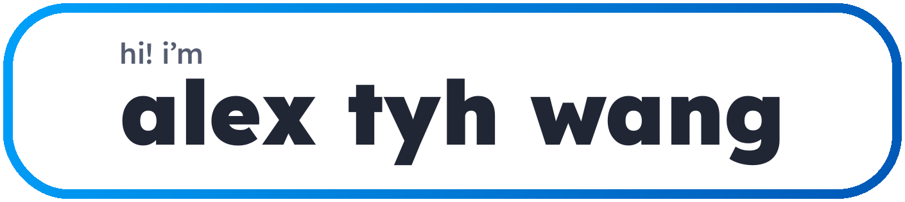

<picture>
  <source media="(prefers-color-scheme: dark)" srcset="alexdark.svg">
  <source media="(prefers-color-scheme: light)" srcset="alexlight.svg">
  
</picture>

  
  
  

Hi, I'm Alex — a full stack developer & designer passionate about building exciting projects and exploring generative AI. I'm currently studying Computer Science at the [Rochester Institute of Technology](https://www.rit.edu/).

---

### What I'm Up To

- 📚 **Studying** Computer Science at RIT (Expected Graduation: May 2028)
- 🚀 **Founder** of Bay Area Stem Academy ([BASA](https://bayareastemacademy.org)), a non-profit providing free STEM education to students — we've reached over 700 learners!
- 👨‍💻 **Tinkering** with personal projects in my free time

---

### A Couple of My Projects

- [**Chatio Agentic Behavior Benchmark**](https://chatio.dev): An evaluation suite for large language models that focuses on real-world usability.
- [**Word Hunt Game**](https://wordhunt.org): An interactive word game built with Next.js and TypeScript.
