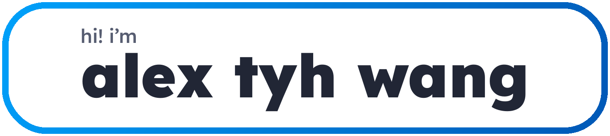
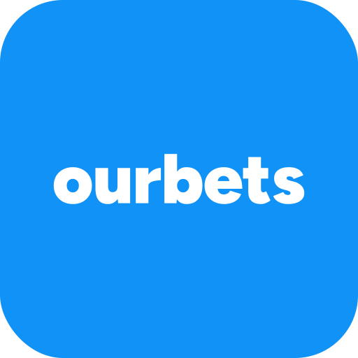
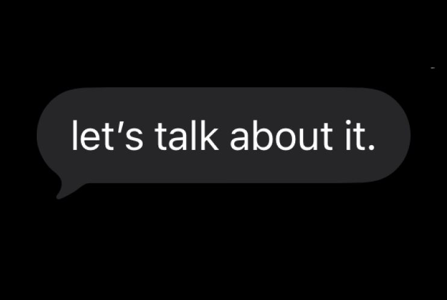
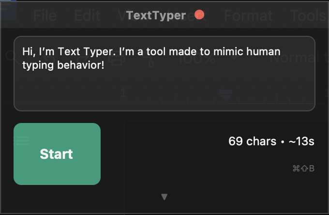

<picture>
  <source media="(prefers-color-scheme: dark)" srcset="alexdark.svg">
  <source media="(prefers-color-scheme: light)" srcset="alexlight.svg">
  
</picture>

  
  
  

Hi, I'm Alex Tyh Wang. I study Computer Science at [RIT](https://www.rit.edu/) and build AI products, games, and useful tools.

### Projects

-  [**Chatio Chat**](https://github.com/alextyhwang/chatio-chat): An open source general use AI chat for developers. Works with any model, you can create and test your harness. 
  OpenAI API, Anthropic, Google Vertex, 300+ OpenRouter models, BYO API keys, local browser storage, Apache-2.0.
-  [**Chatio Benchmark**](https://chatio.dev): A LLM benchmark focused on practical assistant behavior. ~500 private prompts 
  30 leading models, 5 pillars, human review, LLM judges, deterministic checks.
-  [**Word Hunt**](https://wordhunt.org): Word-tile game with daily puzzles, free play, friend challenges, and leaderboards. 
  2100+ Active Users, 105K Search impressions, 3.9K organic clicks, and 14,988 page views in past 30 days.
-  [**OurBets**](https://ourbets.app): Prediction markets for friend groups, with virtual balances, live odds, charts, and leaderboards.

### More Open Source

-  [**iMessages Chatbot Server**](https://github.com/alextyhwang/iMessages-Chatbot-Server): Python iMessage API gateway for concurrent AI conversations through macOS Messages.
-  [**texttyper**](https://github.com/alextyhwang/texttyper): Human-like typing automation with configurable WPM, natural pauses, typo correction, and markdown support.
-  [**ATW Client**](https://github.com/alextyhwang/ATW-Client): Minecraft 1.8.9 client focused on Hypixel BedWars improvements.
-  [**ATW's Levelhead**](https://github.com/alextyhwang/ATW-s-Levelhead): Hypixel Levelhead mod for Weave.

### Elsewhere

-  Founder of [**Bay Area Stem Academy**](https://bayareastemacademy.org): 660+ students taught, $35,000+ in free Stem education, $5,000+ donated, 15+ camps hosted, 5+ partner schools, and a SanDisk collaboration.
